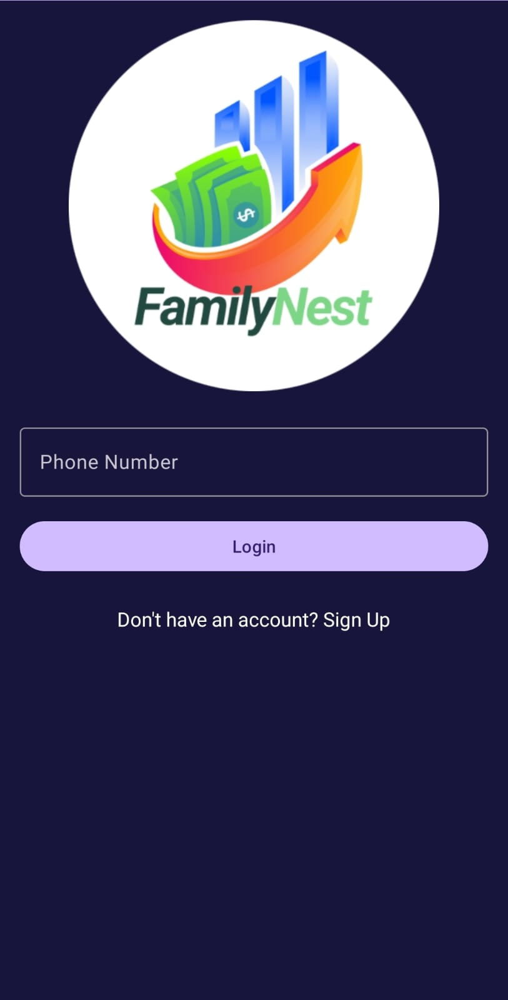
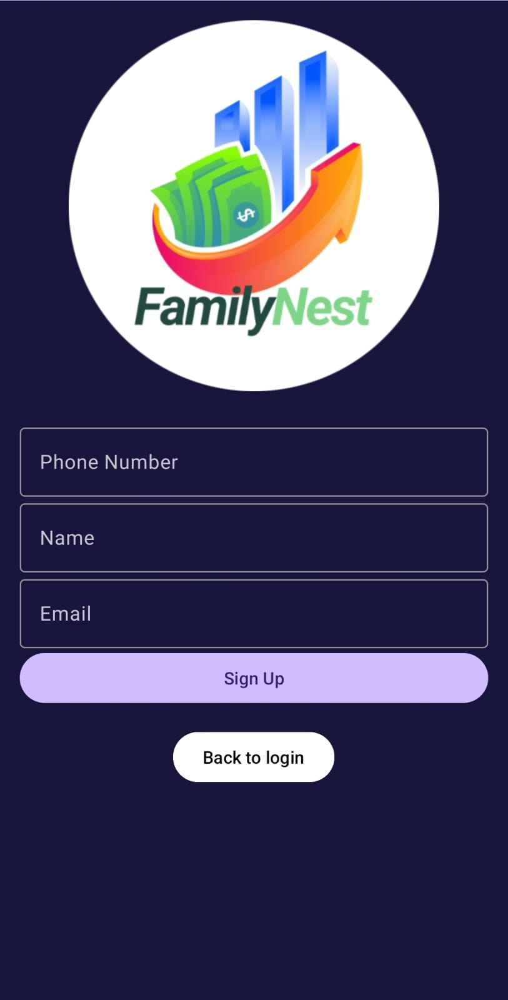
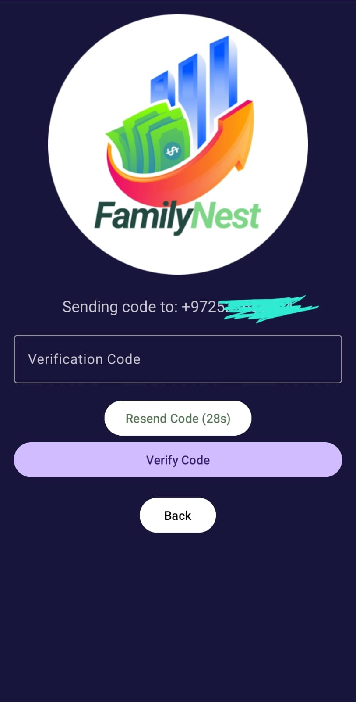
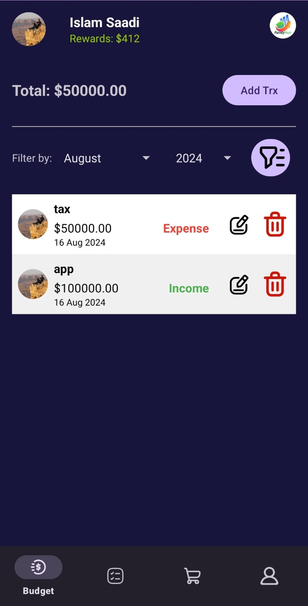
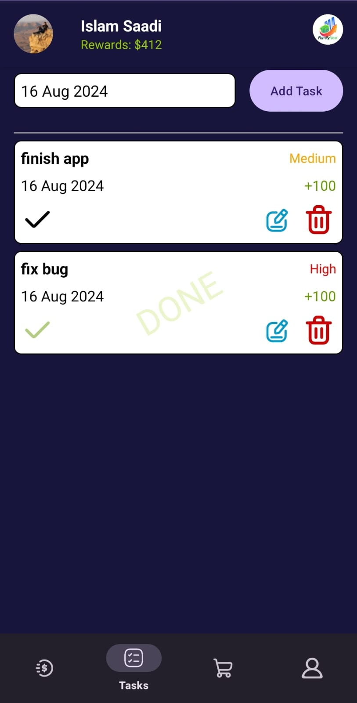
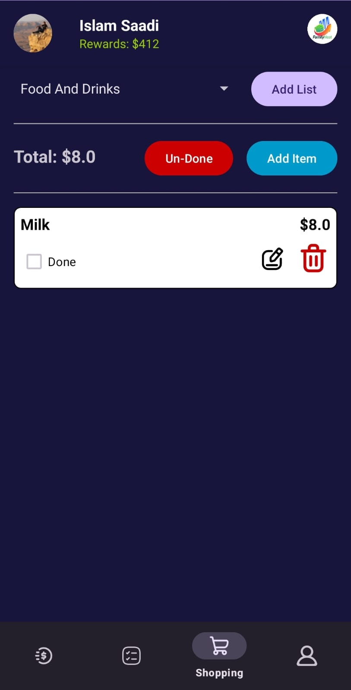
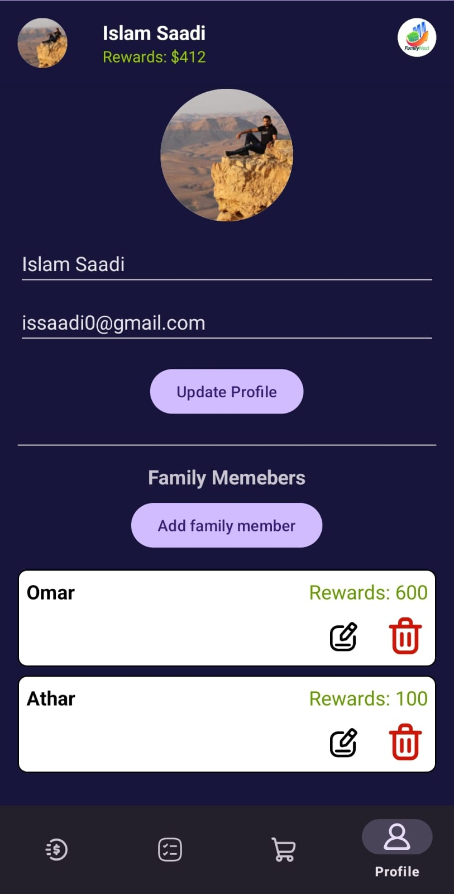
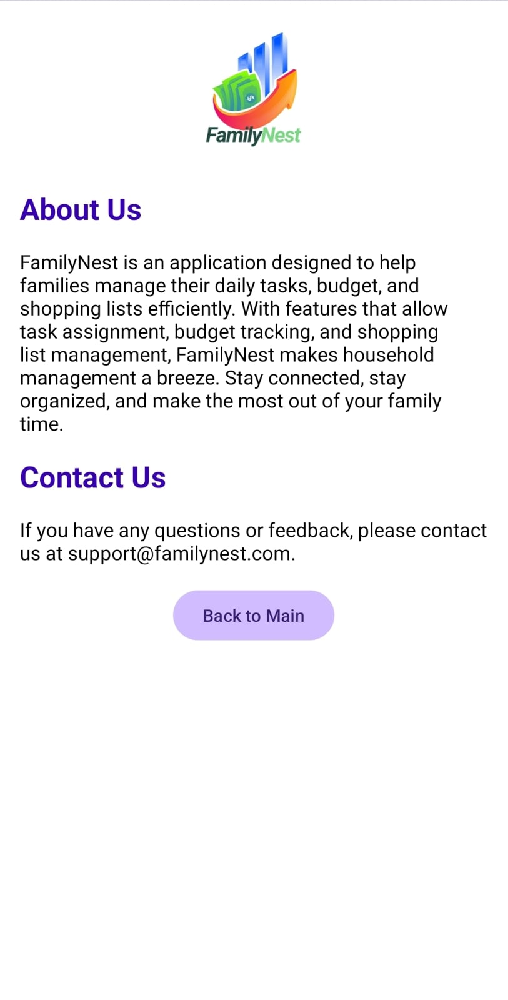

# FamilyNest

**FamilyNest** is an application designed to help families manage their daily tasks, budgets, and shopping lists efficiently. With a user-friendly interface and a suite of features that promote collaboration and organization, FamilyNest makes household management a breeze.

## Features

- **Task Management**: Assign tasks to family members, set priorities, and track completion. Rewards are given for completing tasks.
- **Budget Tracking**: Keep track of household budgets with detailed records of income and expenses. View the budget by month and year, and filter transactions as needed.
- **Shopping Lists**: Create and manage multiple shopping lists. Mark items as bought, edit, and delete items, and track total spending.
- **Family Member Management**: Add, edit, and delete family members. Assign tasks and track rewards for each family member.
- **Profile Management**: Update your profile, including your profile picture, name, and email address.
- **About Us & Contact Us**: Learn more about the FamilyNest app and how to get in touch with us.

## Screenshots

## Usage

1. **Task Management**: Navigate to the Tasks screen from the bottom navigation bar. Add new tasks, edit existing ones, or mark tasks as done. Select the family member who completed the task to allocate rewards.
2. **Budget Tracking**: Go to the Budget screen to view your financial records. You can add new items, filter by month and year, and see the total balance.
3. **Shopping Lists**: Manage your shopping lists by selecting a list, adding items, and marking them as done when purchased. You can also clear the Done mark from all purchased items from the list.
4. **Profile Management**: Update your profile information and manage your family members. You can also change your profile picture by selecting an image from your device.

## Configuration
**Firebase Setup**
1. Create a new Firebase project in the Firebase Console.
2. Add your Android app to the project and download the google-services.json file.
3. Place the google-services.json file in the app directory of your project.
4. Enable Firebase Authentication, Realtime Database, and Firebase Storage in your Firebase project.

## Contributing

Contributions to FamilyNest are welcome! If you find a bug or have a feature request, please open an issue or submit a pull request.

## License

This project is licensed under the MIT License.